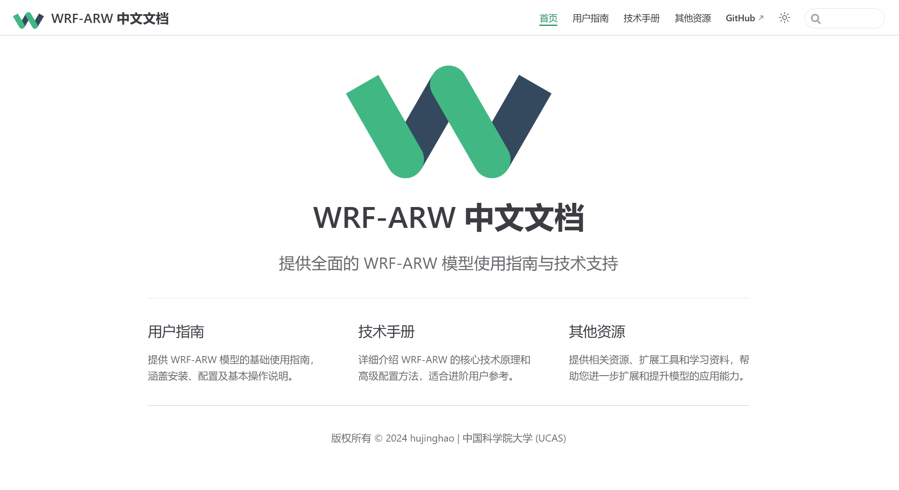

    

<h1 align='center'>WRF-ARW 中文文档</h1>

> 本文档基于 WRF-ARW 官网的英文资料翻译整合而成，旨在为大家提供简明易懂的中文使用指南和技术支持。由于个人学识有限，难免会有不足之处，欢迎大家批评指正，共同完善！

## 介绍

    

WRF-ARW (Advanced Research Weather Research and Forecasting) 是一个功能强大的大气建模系统。该中文文档汇集了模型配置、运行和分析的全面指南，帮助研究人员和工程师更高效地使用WRF-ARW模型。

---

## 特点

- **跨平台兼容**：支持多种操作系统和硬件架构，适用于并行计算环境。
- **模块化设计**：包含WRF、WPS、WRFDA等模块，支持多种气象和环境模拟应用。
- **丰富的物理过程**：提供多种物理方案配置，可根据需求自定义参数化方案。
- **数据同化能力**：支持多维变分同化与集合数据同化，适合高精度气象模拟。
- **强大的可视化工具**：与NCAR Graphics、NCL、VAPOR等工具兼容，为数据分析和结果展示提供便利。

---

## 网址

[WRF-ARW 中文文档](https://your-vuepress-site-url.com) 

有关项目的更多信息与官方资源，请访问以下链接：
- 官方英文文档：[WRF-ARW 官方文档](https://www2.mmm.ucar.edu/wrf/users/)
- WRF-ARW GitHub仓库：[WRF-ARW GitHub](https://github.com/wrf-model/WRF)

---

## License

[MIT © 2024 hujinghao | 中国科学院大学 (UCAS)](./LICENSE)
